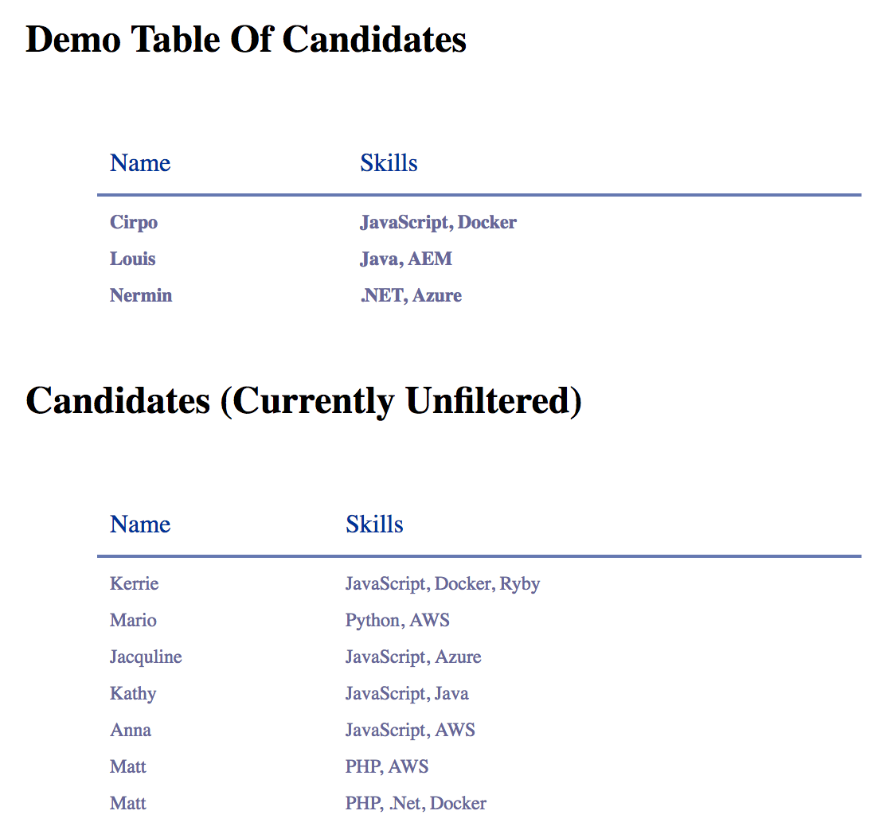
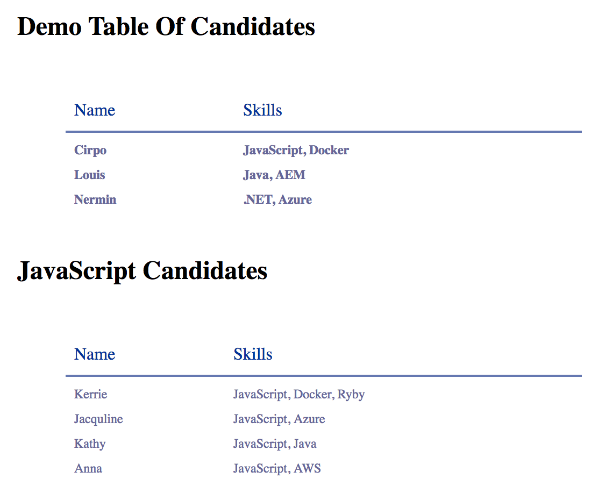

# Specification (paraphrased)

Open the [HTML file](#html-file). You will see [two tables](#initial-state):
the first is a hard-coded example, the second is the same structure but created
via JavaScript.

The `filterCandidateBySkill()` function takes a list of candidates and simply
returns them. Not very useful, we know - but that's where we need your help.
Your task is to modify `filterCandidateBySkill()` so that it filters the
candidates by the JavaScript skill, [altering](#target-state) the second table.

Optional bonus points:

* Add more tables with candidates filtered by different skills,
* Refactor the code as you please (splitting files, changing variables, etc.),
* Improve the look and feel.

The most important thing is the code being clean, simple, consistent, stable,
and crystal clear. Don't over-engineer the solution.

## References

### HTML File <a id="html-file"></a>

``````````````````````````````````````````````````````````````````````````` html
<!DOCTYPE html>
<html lang="en">

<head>
  <meta charset="UTF-8">
  <meta name="viewport" content="width=device-width, initial-scale=1.0">
  <meta http-equiv="X-UA-Compatible" content="ie=edge">
  <style type="text/css">
    .candidates {
      font-size: 12px;
      background: #fff;
      margin: 45px;
      width: 480px;
      border-collapse: collapse;
      text-align: left;
    }

    .candidates th {
      font-size: 16px;
      font-weight: normal;
      color: #039;
      padding: 10px 8px;
      border-bottom: 2px solid #6678b1;
    }

    .candidates td {
      color: #669;
      padding: 9px 8px 0px 8px;
    }

    .candidates tbody tr:hover td {
      color: #009;
    }
  </style>
  <title>Document</title>
</head>

<body>
  <div id="container">
    <h2> Demo Table Of Candidates <h2>
    <table class="candidates" id="candidates_example">
      <thead>
        <tr>
          <th>Name</th>
          <th>Skills</th>
        </tr>
      </thead>
      <tr>
        <td>Cirpo</td>
        <td>JavaScript, Docker</td>
      </tr>
      <tr>
        <td>Louis</td>
        <td>Java, AEM</td>
      </tr>
      <tr>
        <td>Nermin</td>
        <td>.NET, Azure</td>
      </tr>
    </table>
    <h2> Candidates (Currently Unfiltered) <h2>
  </div>


  <script type="text/javascript">
    const newCandidates = [
      { name: "Kerrie", skills: ["JavaScript", "Docker", "Ruby"] },
      { name: "Mario", skills: ["Python", "AWS"] },
      { name: "Jacquline", skills: ["JavaScript", "Azure"] },
      { name: "Kathy", skills: ["JavaScript", "Java"] },
      { name: "Anna", skills: ["JavaScript", "AWS"] },
      { name: "Matt", skills: ["PHP", "AWS"] },
      { name: "Matt", skills: ["PHP", ".Net", "Docker"] },
    ];

    function removeRowsFromTable(table) {
      const rows = table.getElementsByTagName("tr");

      while (rows.length > 1) {
        table.deleteRow(1);
      }
    }

    function insertCandidate(tbody, name, skills) {
      const newRow = tbody.insertRow();
      const nameCell = newRow.insertCell();
      const skillCell = newRow.insertCell();

      const candidateName = document.createTextNode(name);
      const candidateSkills = document.createTextNode(skills.join(', '));

      nameCell.appendChild(candidateName);
      skillCell.appendChild(candidateSkills);
    }

    function addCandidatesToTable(table, candidates) {
      candidates.forEach(candidate => insertCandidate(table, candidate.name, candidate.skills));
    }

    function filterCandidateBySkill(candidates, skill) {
      // INSERT YOUR LOGIC HERE   <-------------------------
      return candidates;
    }

    const candidatesTable = document.getElementById("candidates_example");
    const newCandidatesTable = candidatesTable.cloneNode(true);

    removeRowsFromTable(newCandidatesTable);
    const newTbody = newCandidatesTable.getElementsByTagName('tbody')[0];

    const filteredCandidates = filterCandidateBySkill(newCandidates, 'JavaScript')
    addCandidatesToTable(newTbody, filteredCandidates)

    document.body.appendChild(newCandidatesTable);

  </script>
</body>

</html>
````````````````````````````````````````````````````````````````````````````````

### Initial State <a id="initial-state"></a>



### Target State <a id="target-state"></a>


